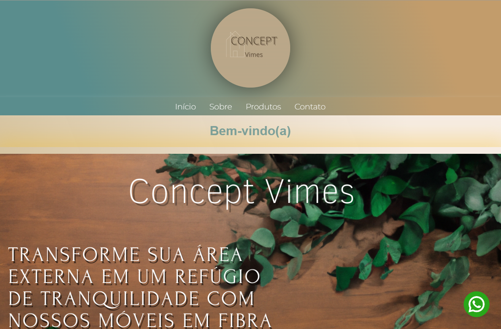

🪑🌿 Concept Vimes 🪑🌿

Concept Vimes é uma loja virtual especializada na venda de móveis artesanais em vime. Com um design elegante e responsivo, a plataforma oferece uma experiência intuitiva para quem busca sofisticação, conforto e estilo natural na decoração de interiores e exteriores.

🛋️ Sobre o Projeto 🛋️

A loja apresenta um catálogo exclusivo de produtos feitos com vime, combinando tradição artesanal com um visual moderno. Ideal para clientes que valorizam estética, sustentabilidade e qualidade.

🚀 Funcionalidades 🚀

1. Navegação simples e intuitiva
2. Layout 100% responsivo para desktop e mobile
3. Catálogo de móveis em vime com fotos e descrições
4. Página de contato com formulário personalizado
5. Link para redes sociais e canais de atendimento

🛠️ Tecnologias Utilizadas 🛠️

•HTML
•CSS
•JavaScript
•Netlify (deploy)

🌐 Deploy 🌐

Acesse a versão online do site:
👉 https://conceptvimeson.netlify.app/

📦 Como usar localmente 📦

1. Clone o repositório:
👉 git clone https://github.com/unkdep/ConceptVimeson.git

2. Abra o arquivo index.html no navegador

Observação: O projeto é estático e não requer instalação ou servidor local.

📄 Licença 📄

Este projeto está sob a licença MIT. Consulte o arquivo LICENSE para mais detalhes.

